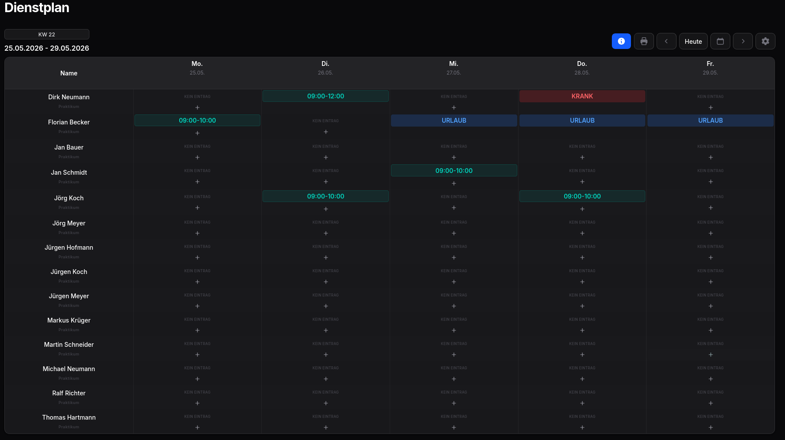
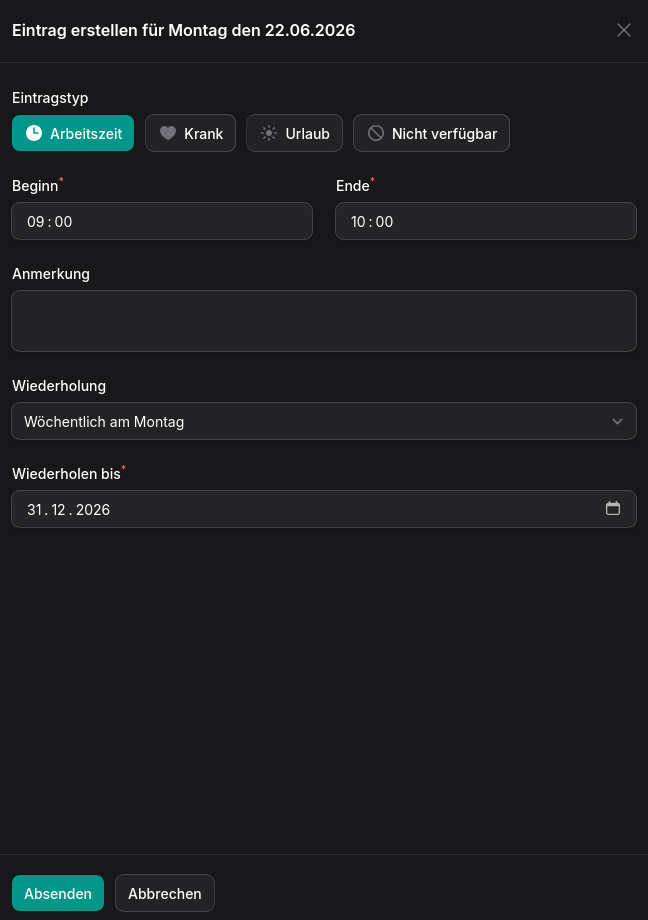
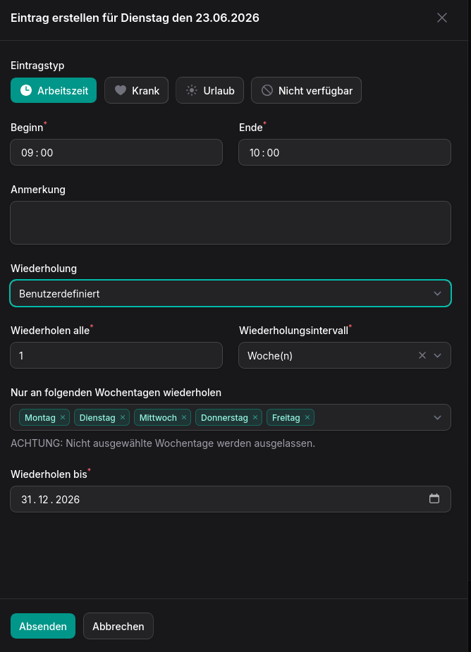

# Advanced Roster for Filament

[](https://packagist.org/packages/occtherapist/advanced-roster-for-filament)
[](https://packagist.org/packages/occtherapist/advanced-roster-for-filament)
[](LICENSE)
[](https://packagist.org/packages/occtherapist/advanced-roster-for-filament)

**A flexible weekly roster page for Filament** — drag-and-drop entries, row reordering, recurring shifts, day notes, and optional PDF export.

Built for **Filament v4 and v5** on **Laravel 11, 12, and 13**. Assign any Eloquent model as roster rows (default: `User`), scope data to your tenant or team, and extend validation rules when you need them.

---

## Screenshots

### Weekly overview

Drag-and-drop entries across days and people, color-coded entry types, and optional day notes in the header row.



### Create entries

Entry types: work, sick, vacation, and unavailable — with optional recurrence.



### Custom recurrence

Daily, weekly, or custom patterns with weekday selection and repeat-until date.



---

## Why this package?

| Need | This package |
|------|--------------|
| **Weekly roster** in a Filament panel | Ready-made `RosterPage` with calendar navigation |
| **Any model as rows** | Configurable assignee model (default: `User`) |
| **Drag & drop** entries and row order | Move, copy, and reorder — persisted per user and scope |
| **Recurring entries** | Series with edit/delete for single or future occurrences |
| **Day notes** | Optional colored notes per day (feature-flagged) |
| **No hard-coded HR rules** | Overlap check built-in; custom rules via validator registry |
| **Multi-tenant ready** | `RosterScopeResolver` — Filament tenancy as default |
| **PDF or browser print** | Spatie PDF when available, print-optimized Blade as fallback |
| **German & English** | Translations included |

---

## Features

- **Filament page plugin** — register once on your panel
- **Configurable assignee model** — defaults to `User`, override via config or model methods
- **Entry types** — work, sick, vacation, unavailable (or your own enum)
- **Drag & drop** — move and copy entries between days and rows
- **Row reordering** — custom sort order per user and scope (not stored on the user model)
- **Recurrence** — daily, weekly, monthly, and custom weekday patterns
- **Day notes** — optional per-day notes with recurrence (`roster.features.notes`)
- **Overlap validation** — enabled by default, disable via config
- **Validator registry** — register custom `RosterEntryValidator` classes
- **Section registry** — one section in v1, add more via `RosterSection` contract
- **Scope resolver** — abstract tenancy/team/location scoping
- **Print / PDF** — optional PDF export with print-friendly fallback view
- **Configurable week** — week start and visible day count (default: Mon–Fri)
- **i18n** — English and German

---

## Requirements

- PHP 8.2+
- [Filament](https://filamentphp.com/) 4 or 5
- Laravel 11, 12, or 13

**Optional** (PDF export):

| Package | Purpose |
|---------|---------|
| `spatie/laravel-pdf` | PDF generation for `printAction()` |

Without a PDF library, the package falls back to a print-optimized Blade view (browser print).

---

## Installation

```bash
composer require occtherapist/advanced-roster-for-filament
```

Register the plugin in your panel provider:

```php
use Filament\Panel;
use OccTherapist\AdvancedRosterForFilament\AdvancedRosterForFilamentPlugin;

public function panel(Panel $panel): Panel
{
    return $panel
        ->plugins([
            AdvancedRosterForFilamentPlugin::make(),
        ]);
}
```

Publish and run migrations:

```bash
php artisan vendor:publish --tag=advanced-roster-for-filament-migrations
php artisan migrate
```

Publish config (optional):

```bash
php artisan vendor:publish --tag=advanced-roster-for-filament-config
```

---

## Configuration

```php
// config/advanced-roster-for-filament.php

return [
    'assignee_model' => \App\Models\User::class,

    'entry_type_enum' => \OccTherapist\AdvancedRosterForFilament\Enums\RosterEntryType::class,

    'validate_overlap' => true,

    'week_starts_at' => 'monday',
    'visible_days' => 5,

    'features' => [
        'notes' => true,
        'print' => true,
    ],
];
```

### Assignee model overrides

The assignee model can override config defaults with optional methods:

| Method | Purpose |
|--------|---------|
| `getRosterNameColumn()` | Column used for the row label |
| `getRosterLabel()` | Custom label when a column is not enough |
| `scopeForRoster($query, $scope)` | Filter which records appear as rows |
| `getRosterUrl()` | Optional link from the row header |
| `isVisibleOnRoster($date)` | Hide rows on specific dates |

### Custom entry type enum

Provide your own backed enum in config. It must implement Filament's `HasLabel` and `HasColor` contracts, plus `RosterEntryTypeContract`:

```php
interface RosterEntryTypeContract
{
    public function isFullDay(): bool;
    public function deletesConflictingEntries(): bool;
}
```

### Extension points

| Contract | Purpose |
|----------|---------|
| `RosterScopeResolver` | Resolve `scope_id` / `scope_type` (Filament tenant by default) |
| `RosterSection` | Register additional roster sections (v1 ships one default section) |
| `RosterEntryValidator` | Add create/update/move/copy validation rules |

---

## Authorization

The package does **not** ship permissions or policies. Restrict access in your host app via Filament `canAccess()`, policies, or middleware.

---

## Roadmap

| Version | Focus |
|---------|-------|
| **v0.1.0** | Core roster page, entries, drag & drop, row order, recurrence |
| **v0.2.0** | Day notes, PDF / print fallback |
| **v1.0** | Stable API, test coverage, Filament plugin listing |

---

## Contributing

Contributions are welcome! [Open an issue](https://github.com/OccTherapist/advanced-roster-for-filament/issues) for bugs or feature requests.

---

## License

MIT © [Igor Clauss](https://igorclauss.de)

---

## Author

**Igor Clauss** — Laravel & Filament developer

- Website: [igorclauss.de](https://igorclauss.de)
- GitHub: [@OccTherapist](https://github.com/OccTherapist)
